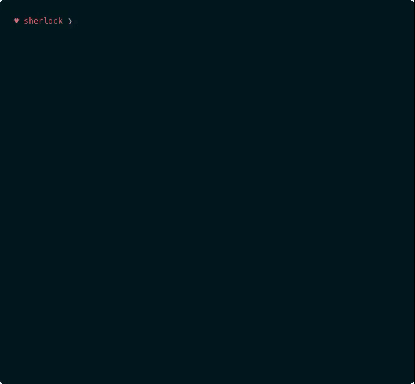

<p align=center>
  </p>
  
  <br>

<p align=center>
  <a href="https://www.instagram.com/bhikan_deshmukh"></a>
  </p>

  <br>

<p align=center>
  <span>Hunt down social media accounts by username across <a href="https://github.com/bhikandeshmukh/sherlock/blob/main/sites.md">social networks</a></span>
  </p><br>


<p align=center>
  <a target="_blank" href="https://github.com/bhikandeshmukh/sherlock/actions" title="Test Status"></a>
  <a href="https://www.instagram.com/bhikan_deshmukh"></a>
  <a href="https://www.instagram.com/bhikan_deshmukh"></a>
  <a href="https://www.instagram.com/bhikan_deshmukh"></a>
  <a href="https://github.com/bhikandeshmukh/followers"></a>
  <a href="https://github.com/bhikandeshmukh/sherlock/network/members"></a>
  <a href="https://github.com/bhikandeshmukh/sherlock/watchers"></a>
  <a href="#">
</p>

###### <p align="center">*This is official repository maintained by us*
###### <p align="center"> *[**Mr. Bee**](https://www.instagram.com/bhikan_deshmukh/) ❤️*

###### <p align="center"> Best Tool For Information Geathering

<p align="center">
  <a href="#installation">Installation</a>
  &nbsp;&nbsp;&nbsp;|&nbsp;&nbsp;&nbsp;
  <a href="#usage">Usage</a>
  &nbsp;&nbsp;&nbsp;|&nbsp;&nbsp;&nbsp;
  <a href="#docker-notes">Docker Notes</a>
  &nbsp;&nbsp;&nbsp;|&nbsp;&nbsp;&nbsp;
  <a href="#contributing">Contributing</a>
</p>

<p align="center">
<a href="https://www.instagram.com/bhikan_deshmukh">

</a>
</p>

### Operating System Requirements
• **Linux** (Any) <br>
• **MacOS** <br>
• **Android** (Using the Termux App {Hackers Keyboard Recommended}) <br>

## Installation

```
console
# clone the repo
$ git clone https://github.com/bhikandeshmukh/sherlock.git

# change the working directory to sherlock
$ cd sherlock

# install the requirements
$ python3 -m pip install -r requirements.txt
```

### Use Online On WebBrowser : (Chrome, Firefox)
[](https://console.cloud.google.com/cloudshell/open?git_repo=https://github.com/bhikandeshmukh/sherlock&tutorial=README.md) 
<br>
[](https://repl.it/github/bhikandeshmukh/sherlock)

## Usage

```
console
$ python3 sherlock --help
usage: sherlock [-h] [--version] [--verbose] [--folderoutput FOLDEROUTPUT]
                [--output OUTPUT] [--tor] [--unique-tor] [--csv]
                [--site SITE_NAME] [--proxy PROXY_URL] [--json JSON_FILE]
                [--timeout TIMEOUT] [--print-all] [--print-found] [--no-color]
                [--browse] [--local]
                USERNAMES [USERNAMES ...]

Sherlock: Find Usernames Across Social Networks (Version 0.14.0)

positional arguments:
  USERNAMES             One or more usernames to check with social networks.

optional arguments:
  -h, --help            show this help message and exit
  --version             Display version information and dependencies.
  --verbose, -v, -d, --debug
                        Display extra debugging information and metrics.
  --folderoutput FOLDEROUTPUT, -fo FOLDEROUTPUT
                        If using multiple usernames, the output of the results
                        will be saved to this folder.
  --output OUTPUT, -o OUTPUT
                        If using single username, the output of the result
                        will be saved to this file.
  --tor, -t             Make requests over Tor; increases runtime; requires
                        Tor to be installed and in system path.
  --unique-tor, -u      Make requests over Tor with new Tor circuit after each
                        request; increases runtime; requires Tor to be
                        installed and in system path.
  --csv                 Create Comma-Separated Values (CSV) File.
  --site SITE_NAME      Limit analysis to just the listed sites. Add multiple
                        options to specify more than one site.
  --proxy PROXY_URL, -p PROXY_URL
                        Make requests over a proxy. e.g.
                        socks5://127.0.0.1:1080
  --json JSON_FILE, -j JSON_FILE
                        Load data from a JSON file or an online, valid, JSON
                        file.
  --timeout TIMEOUT     Time (in seconds) to wait for response to requests.
                        Default timeout is infinity. A longer timeout will be
                        more likely to get results from slow sites. On the
                        other hand, this may cause a long delay to gather all
                        results.
  --print-all           Output sites where the username was not found.
  --print-found         Output sites where the username was found.
  --no-color            Don't color terminal output
  --browse, -b          Browse to all results on default browser.
  --local, -l           Force the use of the local data.json file.
```

To search for only one user:
```
    python3 sherlock user123
```
To search for more than one user:
```
    python3 sherlock user1 user2 user3
```

Accounts found will be stored in an individual text file with the corresponding username (e.g `user123.txt`).

## Anaconda (Windows) Notes

If you are using Anaconda in Windows, using 'python3' might not work. Use 'python' instead.

## Docker Notes

If docker is installed you can build an image and run this as a container.
```
    docker build -t mysherlock-image .
```
Once the image is built, sherlock can be invoked by running the following:
```
    docker run --rm -t mysherlock-image user123
```
The optional `--rm` flag removes the container filesystem on completion to prevent cruft build-up. See: <https://docs.docker.com/engine/reference/run/#clean-up---rm>

The optional `-t` flag allocates a pseudo-TTY which allows colored output. See: <https://docs.docker.com/engine/reference/run/#foreground>

Use the following command to access the saved results:
```
    docker run --rm -t -v "$PWD/results:/opt/sherlock/results" mysherlock-image -o /opt/sherlock/results/text.txt user123
```
The `-v "$PWD/results:/opt/sherlock/results"` options tell docker to create (or use) the folder `results` in the
present working directory and to mount it at `/opt/sherlock/results` on the docker container.
The `-o /opt/sherlock/results/text.txt` option tells `sherlock` to output the result.

Or you can use "Docker Hub" to run `sherlock`:
```
    docker run theyahya/sherlock user123
```
### Using `docker-compose`

You can use the `docker-compose.yml` file from the repository and use this command:
```
    docker-compose run sherlock -o /opt/sherlock/results/text.txt user123
```
## Contributing

We would love to have you help us with the development of Sherlock. Each and every contribution is greatly valued!

Here are some things we would appreciate your help on:

-   Addition of new site support ¹
-   Bringing back site support of [sites that have been removed](removed_sites.md) in the past due to false positives

[1] Please look at the Wiki entry on [adding new sites](https://github.com/bhikandeshmukh/sherlock/wiki/Adding-Sites-To-Sherlock)
to understand the issues.

## Tests

Thank you for contributing to Sherlock!

Before creating a pull request with new development, please run the tests
to ensure that everything is working great.  It would also be a good idea to run the tests
before starting development to distinguish problems between your
environment and the Sherlock software.

The following is an example of the command line to run all the tests for
Sherlock.  This invocation hides the progress text that Sherlock normally
outputs, and instead shows the verbose output of the tests.
```
    $ cd sherlock/sherlock
    $ python3 -m unittest tests.all --verbose
```
Note that we do currently have 100% test coverage.  Unfortunately, some of
the sites that Sherlock checks are not always reliable, so it is common
to get response problems.  Any problems in connection will show up as
warnings in the tests instead of true errors.

If some sites are failing due to connection problems (site is down, in maintenance, etc)
you can exclude them from tests by creating a `tests/.excluded_sites` file with a
list of sites to ignore (one site name per line).

## Stargazers over time

<p align="center">
<a href="https://www.instagram.com/bhikan_deshmukh">

</a>
</p>

### Legal Disclaimer :

Usage of the tool for attacking targets without prior mutual consent is illegal. It's the end user's responsibility to obey all applicable local, state and federal laws. Developers assume no liability and are not responsible for any misuse or damage caused by this program

-------------------------------------------------------------------------------------

### Development by

Modify : [Mr. Bee](https://www.instagram.com/bhikan_deshmukh/)

### <h2 align="center">To Know about Ethical Hacking , Android And Kali Linux Do ♨️ Follow ♨️ Us:-</h2>
<p align="center">
<a href="https://www.instagram.com/bhikan_deshmukh/"></a>
<a href="https://wa.me/918600525401"></a>
<a href="https://www.facebook.com/thebhikandeshmukh"></a>
<a href="https://www.twitter.com/bhikan_deshmukh/"></a>
<a href="https://t.me/dev_aladdin"></a>
<a href="https://rzp.io/l/mrbee"></a>
</p>

-------------------------------------------------------------------------------------
